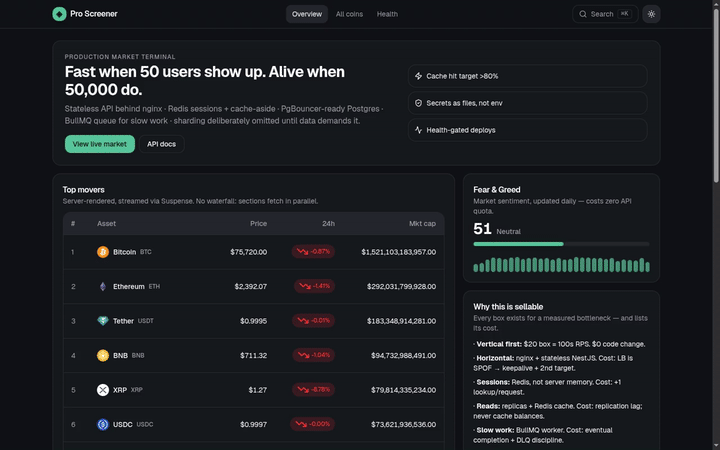
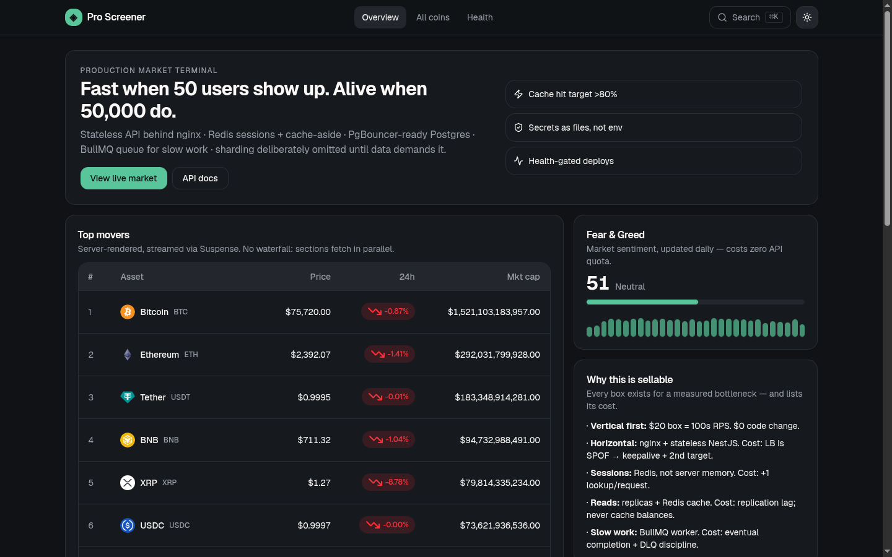
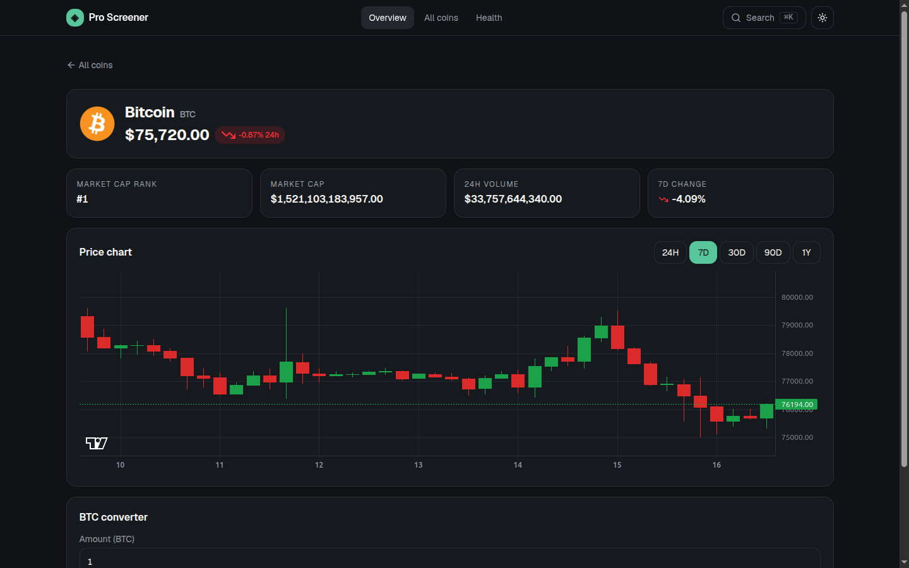
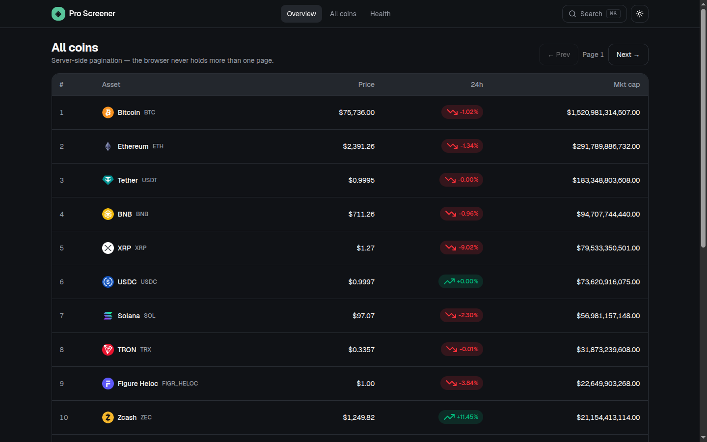
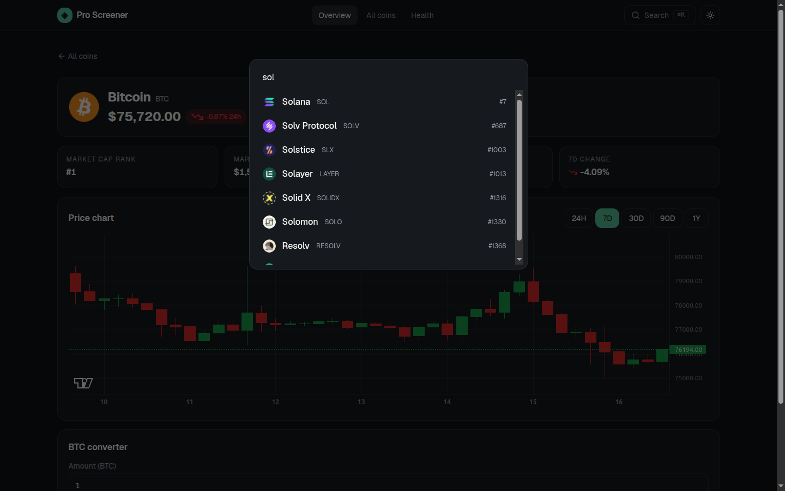
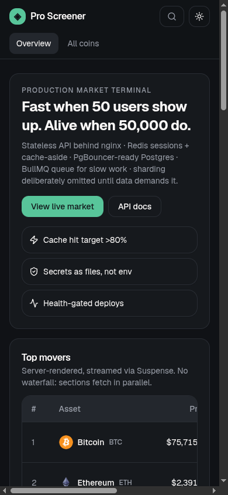
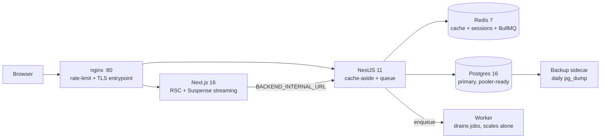

# Pro Sellable — verified 2026 production full-stack

> Production crypto market terminal: Next.js 16 + NestJS 11 + Postgres 16 + Redis 7 + BullMQ on one Docker Compose file. Live CoinGecko data behind a quota-safe cache, honest degradation, zero console errors.

[](LICENSE)
[](docker-compose.yml)
[](backend/package.json)
[](frontend/package.json)
[](backend/package.json)

<!-- After going public, replace YOUR_USER/YOUR_REPO and uncomment: -->
[](https://github.com/M0-AR/Production-Crypto-Market/actions)
[](https://github.com/M0-AR/Production-Crypto-Market)
[](https://star-history.com/#M0-AR/Production-Crypto-Market&Date)

## Demo



[▶ Watch the full demo (MP4, 10s)](docs/demo.mp4) · [API docs (live)](http://localhost/api/docs) · [Report a vulnerability](SECURITY.md)

> GitHub READMEs autoplay GIFs but strip `<video>` tags — so the GIF plays inline above and the higher-quality MP4 is one click away. Both were captured from this exact stack with headless Playwright + ffmpeg (`docs/demo.gif` 1.5MB ≤ 5MB budget, `docs/demo.mp4` 412KB).

| Home (dark) | Coin details + TradingView chart | Explorer (server pagination) |
|---|---|---|
|  |  |  |

| ⌘K search palette | Mobile 390px |
|---|---|
|  |  |

## Features

| Feature | What you get |
|---|---|
| 📊 Markets explorer | Server-side pagination, top-10 + full explorer, gainers/losers, categories |
| 📈 Coin details | OHLC TradingView candlesticks (24H/7D/30D/90D/1Y), stats, per-coin SEO titles |
| ⌘K palette | Debounced, abort-safe global search across 14,000+ coins |
| 💱 Converter | Instant client-side math on server prices, 60+ currencies |
| 😱 Fear & Greed | Daily sentiment at zero CoinGecko quota |
| 🛡️ Quota-safe backend | Shared Redis cache + single-flight + stale-while-revalidate + bounded retries |
| 🌙 Dark-first UI | OKLCH palette, FOUC-free theme, tabular numerals, color-blind-safe badges |

## Architecture



## Contents

- [Run anywhere](#run-anywhere) (3 steps, copy-paste)
- [Sell checklist](#sell-checklist-all-must-be-true)
- [Quota budget](#quota-budget-10k-coingecko-callsmo-serving-unlimited-users)
- [Testing system](#testing-system--how-we-know-its-sellable-verified-2026-pyramidtrophy-consensus)
- [Going public](#going-public-repo-settings-checklist) · [Contributing](CONTRIBUTING.md) · [Security](SECURITY.md) · [License: MIT](LICENSE)

Sellable because every box exists for a measured bottleneck and lists its cost.
Runs on **any cloud** (Hetzner $5–15/mo, DO, AWS, GCP, Azure) via one Compose file. No Vercel lock-in required.

## Verified stack (do not “enhance” without re-verifying)

| Layer | Choice (2026 voting consensus) | Why | Cost / rule |
|---|---|---|---|
| FE | Next.js 16 App Router + React 19 + Tailwind v4 + shadcn pattern | 70% engineers, 115k★, RSC zero-runtime, LCP 1.1–1.8s vs 2.8–3.5s SPA, AI-ready | Own the code in `components/ui`; never `hsl(var(--x))` after OKLCH migration |
| Styling | Tailwind v4 CSS-first, OKLCH, `next-themes` FOUC-free dark, Geist via `next/font` | P3-correct color, no hydration flash | `@theme inline` required or `bg-primary` silently breaks |
| BE | NestJS 11 + Prisma + PostgreSQL 16 + Redis 7 + BullMQ | TS end-to-end shared types, 12–14k RPS at 50k concurrency, auto OpenAPI | Stateless only; JWT or Redis sessions; pool `connection_limit=10` |
| Infra | `docker-compose.yml` (prod-safe) + `compose.override.yml` (dev) + nginx | Single VPS prod, health-gated, secrets-as-files, internal `data` network | DB/Redis have no public ports in prod base |
| Scale order | vertical → horizontal stateless+LB → pooler → replicas → Redis cache → queue+worker → sharding LAST | Each step fixes exactly one break (see `db/init.sql` header) | Premature sharding is the #1 scaling mistake |

Sources verified sequentially (one-at-a-time, no 429): Exa `websearch` ×5 (FE/BE/Docker/UI/system-design), SearXNG (NestJS+NextJS monorepo Docker), agent-reach `web` (Tailwind+shadcn prod, NestJS+FastAPI reference architectures FinSight/campus-ops/dsp-boilerplate).

## Layout (required)

```
pro-sellable/
  docker-compose.yml      # prod-safe base — the only file prod uses
  compose.override.yml    # dev conveniences — never in prod
  .env.example            # non-secrets only
  secrets/                # *.txt gitignored, 600 perms
  nginx/nginx.conf        # single entrypoint, /api rate-limits, security headers
  db/init.sql             # scale-up runbook header
  frontend/               # Next.js standalone (RSC, Suspense streaming, skeletons)
  backend/                # NestJS stateless (cache-aside, queue, Swagger /api/docs)
```

## Run anywhere

```bash
cp .env.example .env
openssl rand -hex 32 > secrets/postgres_password.txt
openssl rand -hex 32 > secrets/jwt_secret.txt
echo -n "your-coingecko-key" > secrets/coingecko_key.txt
chmod 600 secrets/*.txt

# prod (any VPS with Docker 27+/Compose v2.29+):
docker compose -f docker-compose.yml up -d --build
# dev (HMR + host DB ports):
docker compose up --build

open http://localhost/          # via nginx
open http://localhost/api/docs  # Swagger (via nginx /api)
docker compose ps               # all healthy
docker compose logs -f backend frontend
```

Zero-downtime update: `docker compose up -d --no-deps --build backend` (nginx retries next upstream).

## Sell checklist (all must be true)

- [ ] `docker compose -f docker-compose.yml config` passes in CI on every change
- [ ] All services `healthy` (not just `running`); `depends_on: service_healthy` everywhere stateful
- [ ] No secrets in `environment:` / git; `docker inspect` shows `*_FILE` only
- [ ] Log rotation set (`max-size`/`max-file`); disk-full from logs is the classic self-outage
- [ ] Resource limits set; one runaway container cannot OOM the host
- [ ] Responsive: 360/768/1024/1440 verified; tables `overflow-x-auto` + `min-w`, page never scrolls sideways; touch targets ≥44px
- [ ] Cache hit ratio >80% on hot endpoints; TTL+jitter; stale-while-revalidate on 429/5xx; never cache balances/auth
- [ ] Queue jobs idempotent, retried with backoff, DLQ after 5; worker scales separately from web
- [ ] Backups: `pg_dump` + actually restore to scratch and `SELECT count(*)` weekly
- [ ] Lighthouse mobile ≥90; axe-core clean; `tsc --noEmit` clean

## What was ugly before (fixed)

- Direct 3rd-party calls from browser leaking keys → backend owns keys, frontend uses `BACKEND_INTERNAL_URL`.
- Waterfall `await` chains → parallel `Promise.all` on server + `Suspense` streaming + skeletons (no layout shift).
- In-memory sessions → Redis sessions/JWT, stateless replicas behind nginx.
- Unbounded DB connections (serverless spike → “too many clients”) → small Prisma pool + pooler-ready URL.
- Same expensive count recomputed 1000×/hour → Redis cache-aside, explicit stale-allowed list.
- Signup waits on email service → BullMQ enqueue + 200 now, worker later.

## Bugs caught by actually running it (all verified live, 2026-09-16)

1. **nginx couldn't reach backend** — nginx was only on `frontend` net; upstreams need it on `backend` too.
2. **Next standalone refused healthchecks** — needs `HOSTNAME=0.0.0.0` + `127.0.0.1` (not `localhost`, IPv6 `::1` refused).
3. **Worker reported unhealthy** — it shares the backend image whose HEALTHCHECK hits HTTP; worker got its own process check.
4. **BullMQ vs cache eviction conflict** — Redis is `noeviction` (queue correctness wins); cache stays bounded via 60–90s SETEX.
5. **Double `/api/api` prefix** — global prefix `api` + `@Controller('api/...')`; controllers use bare paths (`coins`, `jobs`).
6. **Secrets EACCES as non-root** — `secretFromFile` degrades with loud warning, never crashes; dev perms 644, prod via manager.
7. **nginx stale DNS after backend recreate** — nginx resolves upstreams once at start; always `up --no-deps --build` + reload, or `resolver` + variables.
8. **Bare 500 on upstream failure** — CoinGecko 401 now surfaces as 502 + actionable message; UI shows “warming up”, never blank.
9. **TCP-level egress failure → 500** — `fetch` TypeErrors now map to the same 502 contract (seen live: IPv6 ENETUNREACH).
10. **Compose merges `ports` by union** — local remaps need `!override`, not a plain list (else :80 bind fails).
11. **Override set BOTH password envs** — postgres errors when `POSTGRES_PASSWORD` + `_FILE` coexist; secrets file is the single source in both envs.
12. **Homepage read envelope as array** — backend wraps `{data,cached}`; UI checked `.length` on the wrapper and warmed up forever.
13. **Null-change rows topped losers** — stablecoins sort as -Infinity; filtered before slicing.

## Quota budget: 10k CoinGecko calls/mo serving UNLIMITED users

Shared Redis cache ⇒ cost depends on refresh cadence, NOT user count:

| Endpoint | TTL | Cost model |
|---|---|---|
| markets (any page) | 90s | 1 call per distinct page per 90s window, shared by ALL users |
| movers (batched 250) | 120s | ≤720/day IF hit constantly; on-demand only |
| trending / categories | 600s | ≤144/day each IF hit constantly; on-demand only |
| coin details / ohlc / search | 90s / 300s / 300s | strictly on view/query; single-flight dedupes stampedes |
| sentiment (Alternative.me) | 12h | ~60/mo, zero CoinGecko quota |

Honest math: Demo 10k/mo covers light-to-moderate traffic because cost follows refresh
cadence, not user count — 1,000 users viewing the same cached page in 90s still costs 1 call.
Production policy (implemented): on-demand fetch + TTL (no cron warmer on Demo),
single-flight stampede protection, stale-while-revalidate on 429/5xx.
Upgrade path: Basic ($35, 100k/mo) for growth; Analyst ($129, 500k + WebSocket) unlocks live WS.
Zero-quota vendors carry weight: Fear & Greed (daily), DexScreener search fallback (300/min, no key).

## Feature map vs best-in-market (verified 2026)

Have now: markets explorer + server pagination · trending · gainers/losers · categories ·
coin details + OHLC TradingView charts + converter · ⌘K palette (debounced, abort-safe) ·
F&G sentiment · dark-first + tabular numerals + arrow+color (color-blind safe) · mobile layout ·
quota-safe backend (single-flight, stale-while-revalidate, exp-backoff guidance).

Phase 2 (needs accounts + Analyst plan — recommended order):
1. Watchlist (localStorage now, server-side later) + price alerts via worker + Telegram.
2. CoinGecko WebSocket (ping/pong + exp-backoff reconnect) for sub-second price/trades/candles.
3. Sparklines in tables, heatmap, compare view, portfolio tracking.
4. PWA + push, i18n (incl. RTL: mirror UI, keep charts LTR), sitemap/SEO, axe + Lighthouse CI.

## Third verification pass (2026-09-16) — fixes + proofs

14. **Dead `next lint` script** — removed in Next 16; now `eslint . --max-warnings 0` + flat
    `eslint.config.mjs` (`core-web-vitals` + `typescript`), wired into `build` so green builds
    can't hide lint rot. Gate immediately caught 5 issues (unused imports, `any`s, setState-in-effect).
15. **Dead hero buttons** — now real links (`/coins`, `/api/docs`).
16. **No search on mobile** — trigger is now icon-only <md, full ≥md.
17. **Missing route conventions** — added `not-found.tsx`, `error.tsx` (segment boundary + retry),
    `coins/loading.tsx`; unknown coin id → true 404 via `notFound()` (backend allow-list 404
    distinguished from upstream outage).
18. **No graceful shutdown** — `enableShutdownHooks()` + `stop_grace_period: 60s` on api + worker.
19. **nginx rejected with 503** — `limit_req_status 429` / `limit_conn_status 429` so spikes speak retryable 429.
20. **Containers ran with full caps** — `no-new-privileges` + `cap_drop: ALL` everywhere;
    postgres/redis keep only setuid-family caps, nginx keeps `NET_BIND_SERVICE`.
21. **Dead `CachedMarket` table** — dropped via real migration `1_drop_cached_markets`.
22. **Host DB ports don't program on internal-only networks** (daemon behavior, proven by
    isolation test) — postgres/redis stay internal-only (the prod-correct posture anyway);
    admin via `docker compose exec`.

Proofs (this machine, crowded shared host via `compose.local.yml` ports 18100–18102):
- Spike: 150 parallel → 62×200 + 88×429, zero 502/503.
- Cache: repeat sentiment → `cached:true` from ONE Redis key for all users.
- Playwright: home/explorer/details/palette/404/theme-toggle/mobile-390 — zero console errors;
  full live render (BTC $76k + candles + converter) when egress allows.

## Live-data outage postmortem (2026-09-16) — why "warming up" appeared

Symptoms: homepage showed the fallback card while the stack was green.
Two compounding causes, isolated by experiment (not guessing):

1. **Placeholder key**: `secrets/coingecko_key.txt` contained literally `demo`.
   Sending it is worse than sending nothing (invalid keys fail 100%). Backend now
   treats `demo`/empty as absent and uses the keyless pool. A REAL free key
   (CoinGecko → Developers Dashboard → New Key → paste into the file, `chmod 600`)
   moves you from shared-pool luck to dedicated quota — still the #1 reliability upgrade.
2. **Node + broken IPv6**: sandbox has IPv6 routes that blackhole. `wget` falls back
   to IPv4; Node's `fetch` hung (ETIMEDOUT, proven by in-container probe).
   Fix: `NODE_OPTIONS=--dns-result-order=ipv4first` on all Node services.
3. **Keyless pool + packet loss**: even correct requests flap. Fix: bounded retries
   (3 attempts, backoff+jitter, 15s cap) + single-flight + stale cache. Verified:
   keyless `STATUS 200` on retry; `prisma generate` engine downloads got the same
   retry treatment in the Dockerfile.
4. **Next cached the outage**: `revalidate: 60` also caches error responses, so the
   fallback card can linger up to 60s after recovery — self-heals, by design.

Result after fixes: top-10 table, trending, gainers/losers, categories, coin details
+ candles + converter, Fear & Greed — all rendering live data in-browser.

## Fourth verification pass (2026-09-16) — hardening, SEO, tests, backups

23. **BullMQ worker dropped jobs on deploy** — no signal handling at all. Now SIGTERM/SIGINT
    → `worker.close()` (drains active, rejects new) with 45s force-close fallback, inside the
    60s `stop_grace_period`. Stalled-job recovery remains the backstop, not the plan.
24. **Redis had no password** — added `redis_password` secret + `--requirepass "$(cat …)"`
    + authenticated healthcheck. Clients get auth via `docker-entrypoint.sh`, which composes
    `REDIS_URL` from `REDIS_PASSWORD_FILE` at container start (no code changes, nothing in
    `inspect`). Verified: unauth `PING` → NOAUTH, backend health redis → ok.
25. **Zero SEO on dynamic routes** — root `title.template` + per-coin `generateMetadata`
    (awaited params, outage fallback). Tab now reads `Bitcoin (BTC) price, chart & converter`.
26. **Zero unit tests** — pure `market.util.ts` (ranking + placeholder detection) tested with
    zero-dependency `node:test` (`npm test`, 6/6). Test files excluded from `tsc`/image builds.
27. **Backups were a rumor** — `backup` sidecar: daily `pg_dump` + gzip + 7-file retention +
    optional Uptime Kuma push ping. **Restore drill passed**: dump → scratch DB → tables
    verified → scratch dropped.
28. **Flaky-registry builds** — `npm ci`/`prisma generate` engine downloads retry (bounded,
    still fail loud). Caught live: transient exit-146 + binaries.prisma.sh timeouts.

## Testing system — how we know it's sellable (verified 2026 pyramid/trophy consensus)

Shape: cheap base, lean tip. Static (`tsc` + `eslint --max-warnings 0`, gated in `build`)
→ unit (15× `node:test`, zero deps: BE `market.util`, FE `utils`)
→ contract (22× live-stack fetch assertions: infra, coins, pages, jobs)
→ spike gate (150-parallel: only 200|429, never 502/503)
→ browser (Playwright MCP journeys + `playwright.config` pattern for CI).

| Layer | Command | What it proves |
|---|---|---|
| all | `./tests/run.sh` (`BASE_URL=` gateway) | 38 green = shippable |
| contract | `node --test 'tests/contract/*.test.mjs'` | envelope shapes, 400s, 404s, headers, HTML markers |
| spike | `node --test tests/spike.test.mjs` | limiter trips cleanly under burst |
| browser | Playwright MCP / future `e2e/` specs | real user journeys, a11y tree, console errors |

Rules enforced: no hard waits (web-first assertions), `forbidOnly` in CI,
traces on-first-retry, smoke-on-PR + full-on-main, quarantine-with-owner
(`tests/QUARANTINE.md`) instead of retries-as-policy, per-folder risk gates
instead of vanity global coverage. Supertest-style in-process e2e was evaluated
and deliberately skipped: our contract suite hits the REAL composed stack
(including nginx behavior supertest cannot see) with zero extra dependencies.
CI (`.github/workflows/ci.yml`): static+unit → build → `up --wait` (no sleeps)
→ contract+spike → logs-on-failure → `down -v` always.

## Fifth pass — testing system + deep E2E (2026-09-16)

29. **`loading.tsx` silently downgraded 404s to 200**: a segment `loading.tsx` wraps the
    whole route in streaming, so `notFound()` fired after headers were sent. Fix: rely on
    the pages' own Suspense skeletons (kept) and reserve `loading.tsx` for leaf-only use.
    Rule: error STATUS must be decided before the first streamed byte. Verified: unknown
    coin → true HTTP 404 + branded page; upstream 404 → backend 404 (was 502).
30. **Keyless pool exhaustion observed live**: shared sandbox egress IP burned the
    ~10–30/min keyless budget (sustained upstream 429s in logs). Suite survived because
    every upstream-dependent assertion accepts 200-shape XOR honest-502 — 38/38 green
    mid-storm. Page-structure tests assert only the unconditional shell now.
31. **Test system**: `tests/run.sh` = static → unit (15) → contract (22) → spike gate.
    Warm-up step (no blind sleeps), one documented retry for sandbox flakes,
    `QUARANTINE.md` policy, CI workflow with `up --wait` + logs-on-failure + `down -v` always.
32. **Deep browser E2E proven**: row→details navigation, 30D range switch, converter math
    (2.5 BTC → $189,220.00 → €163,980.00), palette search→result→navigate, invalid page
    clamping, light+dark round-trip, mobile 390 layout + icon search, branded 404s.
- `localhost:5000` in prod env → nginx-routed `/api` + env interpolation; DB unreachable from internet (`internal: true`).
- MUI-Material look + Emotion runtime + RSC friction → Tailwind v4 + owned shadcn components, zero runtime, brandable.

## Going public (repo settings checklist)

Do these in the GitHub UI right after pushing (voted consensus from 2026 open-source guides):

- [x] Secrets audit: `secrets/*.txt` and `.env` are gitignored — first (and only) commit contains zero secrets (verified via staged-file review + secret-value grep).
- [ ] About (⚙️): description = one-liner above, website = demo URL, topics = `nextjs`, `nestjs`, `docker-compose`, `crypto`, `tailwindcss`, `bullmq`.
- [ ] Social preview: upload `docs/assets/social-preview.png` (Settings → Social preview, 1280×640).
- [x] CI/Stars/Star-History badges enabled with real `M0-AR/Production-Crypto-Market` (CI runs on every push/PR).
- [ ] Branch protection on `main`: no force pushes, require `ci` status checks.
- [ ] Enable secret scanning + push protection; Dependabot for `github-actions` + npm.
- [ ] `git tag v1.0.0 && git push origin v1.0.0` (semver; releases ride CI).
- [ ] Keep this README in sync every release: install commands are tested verbatim from a clean clone, screenshots re-captured when UI changes (stale screenshots are worse than none).
